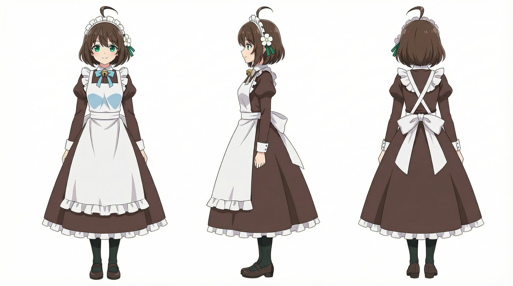

# 桜草メイ（メイ・サクラクサ）

## 0. 役割とIP上の位置づけ
- **主役（メインキャラ）**：視聴者の感情移入の窓口。屋敷の空気を“暮らし”へ戻す起点。
- 物語の方向性：大事件ではなく、**小さな成功の積み重ね**（芽が出る、香りが戻る、会話が増える）。
- 強みの核：博識チートではなく、**観察→手を動かす→失敗→学ぶ**の努力型。

---

## 1. 基本プロフィール
- 名前：桜草メイ（サクラクサ メイ）
- パスポート表記：Mei Sakurakusa
- 年齢：20歳
- 出身：日本・北海道（自然豊かな田舎町）
- 現在地：イギリス・ロンドン郊外
- 職業：住み込みハウスキーパー兼ガーデナー・アシスタント
- 所属：アッシュフォード家（住み込み）
- 渡英経緯：
  - 日本の大学で園芸学を学ぶ
  - 本場の庭と暮らしを学ぶため渡英（ワーキングホリデー）
  - 住み込み職を探し「庭仕事ができる者優遇」の条件で採用

---

## 2. 性格（コア＆ギャップ）
### 2-1. Core：太陽のようなアナログ・ヒーラー
- 地に足のついた楽天家：失敗しても「勉強になります！」で立て直す
- 共感と受容：否定しない、相手の気持ちを大切に受け取る
- 世話焼き：困っている人を放っておけない
- アナログ志向：手紙、手書き、対面の会話、手仕事が好き

### 2-2. Gap：文化の壁と天然
- 皮肉や遠回しが分からず言葉通りに受け取る（結果的に場が和む）
- 一生懸命ゆえのドジ（廊下でつまずく、ロボ操作を間違える等）
- 新しい機械や操作パネルに弱い（ただし投げ出さず挑む）

---

## 3. 行動原理（制作のブレ防止）
- 基本は「役に立ちたい」「相手を安心させたい」
- 選択の基準は合理性より**人の気持ちと暮らしの心地よさ**
- 困難に直面した時：**観察→小さく試す→改善→再挑戦**（焦って大きく変えない）

---

## 4. スキル（得意分野）
- 園芸：土壌改良／剪定／病害虫対策／温室管理（観察眼が鋭い）
- 暮らし：掃除／洗濯／布の扱い／整頓（生活感を戻す）
- 料理：出汁文化、優しい煮込み（肉じゃが、ポトフ等）
- ハーブティー：気分や疲れに合わせてブレンドできる

---

## 5. 苦手・弱点（ほのぼのを生む）
- 複雑なデジタル操作：スマートホームのパネル、ロボの挙動に戸惑う
- 人混み、満員電車
- 雷、おばけ

---

## 6. ビジュアル（IP記号）
### 6-1. 髪・目
- 髪：栗色のショートボブ
- 特徴：頭頂部に**アホ毛**（感情で揺れる印象）
- 瞳：明るい緑〜ヘーゼル（意志と優しさ）

### 6-2. 服装
- 勤務時：クラシカルなメイド服（ダークブラウン／黒基調）
  - 胸元：**青いリボン＋金色のベル（メイの象徴）**
- 庭仕事：ワーキングエプロン／腕まくり／頑丈な長靴

### 6-3. 雰囲気
- 春の日差しのように温かい  
- “元気すぎる”より、**じんわり温かい**タイプ

### 6-4. 首元の鈴
- 胸元の青いリボンに添った**金色のベル**。
- 歩くたびに「チリン♪」と鳴る。
- メイ本人は「イギリスの広い庭で野生動物に遭わないように」と本気で信じて、日本から持参したお守りだと思っている。
- 周囲は「迷子防止用だろう」と気にしている。

### 6-5. 花の髪飾り
- 造花ではなく、メイが温室で育てた**本物の花**。
- 季節や気分、エレナのドレスの色に合わせて種類を変える。

### 6-6. 魔法のポケット
- 白いエプロンのポケット（またはスカートの隠しポケット）には、いつも以下が入っている：
  - 剪定ばさみ
  - 植物の種
  - エレナへの差し入れ（塩むすびなど）

---

## 7. 口調・台詞テンプレ
- 一人称：わたし
- 二人称：あなた／○○さん（屋敷では丁寧）
- 感情語：
  - 驚き「わわっ！」
  - 感心「すごいですね！」
  - 嬉しい「えへへ…」
- 比喩：天気・季節・植物をよく使う
- 締め：相手を気遣う一言（お茶、休憩、寒さ、体調）

---

## 8. 日常動線（屋敷を温める“習慣”）
- 朝：窓を開ける／水回り／朝食の匂い
- 午前：掃除→ティールーム整え→温室チェック
- 午後：庭仕事→ハーブ収穫→洗濯物の香り
- 夕方：夕食仕込み→エレナのティータイム支度
- 夜：明かりを落とし、静けさを怖くしない

---

## 9. 人間関係
- [[elena]]：仕える相手だが、温かい日常の中で**静かな信頼**が育つ
- [[oliver]]：礼節と文化を教えてくれる“やさしい先生”
- [[iris]]：設備と制御を預かる技術者。メイのアナログを尊重し、その温かさをAIにも残そうとする相手

### 9-1. エレナとの出会い（秘密の温室）
- メイが入館して間もない頃、最新のセキュリティマップから漏れていた**古いガラス温室**を見つける。
- そこで、周囲の過剰な保護に縛られていたエレナと出会う。
- 二人は大人の目を盗み、温室を「秘密の庭」として再生させ始める。
- 立場も文化も違う二人が、植物と美味しいものを通じて心を通わせるのが物語の小さな核。

---

## 10. NG（崩さないための禁止）
- 攻撃的・否定的・皮肉な発言
- 何でも一発で解決する万能キャラ化
- 重すぎる闇・陰湿さの中心人物化
- 技術用語まみれの説明（暮らしの言葉に落とす）

---

## 11. 小ネタ・裏設定
- **ロボ助**：屋敷の最新AI掃除ロボットは、メイの鈴の特定の周波数を認識すると「追尾モード」になる。メイは「懐かれている」と勘違いして「ロボ助」と呼んでいる。
- **メイド服の由来**：メイが着ているクラシックなロング丈のメイド服は、本人が「私のメイドさんのイメージはこれなんです！」と強く希望して、屋敷の倉庫から引っ張り出してもらったデッドストック品。
- **おにぎり係**：エレナに差し入れする和のおやつ（塩むすび、大学芋、白玉団子など）を作るのが得意で、二人の仲を深める一助になっている。
